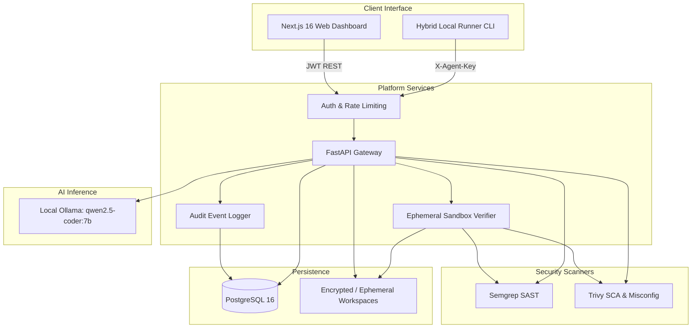

# DefenderAI

**AI-Assisted Software Security Analysis, Remediation & Verification Platform**  
*Local-First Privacy · Cloud-Ready Multi-Tenancy · Hybrid Enterprise Scalability*

[](file:///c:/Users/Aditya/DefenderAI/backend)
[](file:///c:/Users/Aditya/DefenderAI/frontend)
[](file:///c:/Users/Aditya/DefenderAI/backend)
[](file:///c:/Users/Aditya/DefenderAI/docker-compose.yml)

DefenderAI is a production-oriented application security analysis and remediation platform that combines static application security testing (SAST via **Semgrep**), software composition analysis (SCA via **Trivy**), and local AI-assisted code remediation (via **Ollama `qwen2.5-coder:7b`**). 

Unlike conventional AI tools that blindly trust generated fixes, DefenderAI enforces an **empirical verification policy**: proposed code fixes are tested inside an isolated, ephemeral sandbox directory and re-scanned by independent security engines before any changes can be applied to real source code.

---

## Table of Contents

- [Core Capabilities](#core-capabilities)
- [System Architecture & Execution Modes](#system-architecture--execution-modes)
- [Verified Remediation & Patch Pipeline](#verified-remediation--patch-pipeline)
- [Hybrid Local Agent Architecture](#hybrid-local-agent-architecture)
- [Tech Stack](#tech-stack)
- [Quickstart: Local Windows Setup](#quickstart-local-windows-setup)
- [Quickstart: Docker Compose](#quickstart-docker-compose)
- [Automated Test Suite](#automated-test-suite)
- [Documentation Index](#documentation-index)

---

## Core Capabilities

1. **Dual-Engine Security Scanning:**
   - **SAST (Semgrep):** Code injection (SQLi, XSS, Command Injection), unsafe deserialization, hardcoded secrets, and taint tracking with CWE & OWASP metadata tagging.
   - **SCA (Trivy):** Dependency CVE vulnerabilities, fixed package versions, and infrastructure-as-code (IaC) misconfigurations.
2. **Local AI Vulnerability Intelligence:**
   - Deep explanation of root cause, attack vectors, and exploit impact using local Ollama (`qwen2.5-coder:7b`) with prompt-injection defense delimiters (`<UNTRUSTED_SOURCE_SNIPPET>`).
   - Generates contextual, syntactically correct unified diff patches.
3. **Interactive Patch Diff Viewer & Governance:**
   - Full dark-mode unified diff viewer with addition/deletion counters, dual line numbering, and hunk indicators.
   - Formal proposal review workflow: `proposed` → `approved` → `verified` → `applied` (or `rejected` / `rolled_back`).
4. **Isolated Ephemeral Sandbox Verification:**
   - Patches are applied to an ephemeral working copy (`scan-workspaces/{project_id}/verification-workspaces/{proposal_id}`) without touching the primary project source.
   - Automated re-scanning computes before/after finding differentials (`verified_fixed`, `still_vulnerable`, or `new_findings_introduced`).
5. **Safe Source Code Application with Instant Rollback:**
   - Requires explicit approval and successful prior verification.
   - Creates timestamped safety backups (`.defenderai_bak_{timestamp}`) before modifying files.
   - Supports one-click rollback restoring the original files.
6. **Multi-Tenant Isolation & Rate Limiting:**
   - Strict cross-tenant access boundaries enforced across projects, scans, findings, and proposals.
   - Sliding-window rate limiting protecting against login brute-forcing and scan compute abuse.
   - Immutable audit logging (`audit_events` table).

---

## System Architecture & Execution Modes



### Three Execution Modes
- **Local Mode (Default):** Everything (backend, frontend, database, scanners, and AI) runs on developer hardware. Zero proprietary code leaves `localhost`.
- **Cloud Mode:** Centralized web dashboard with hosted PostgreSQL and multi-tenant project isolation.
- **Hybrid Agent Mode:** Enterprise runner runs on developer machines or CI/CD pipelines inside a corporate firewall, executing scans locally and transmitting only normalized finding metadata to the cloud gateway. **Zero source code transmitted.**

---

## Verified Remediation & Patch Pipeline

```
  AI Fix Suggestion
          │
          ▼
┌──────────────────┐
│ Formal Proposal  │ ── Status: proposed
└─────────┬────────┘
          │ (User Click: Verify Patch)
          ▼
┌────────────────────────────────────────────────────────┐
│           Ephemeral Verification Sandbox               │
│  1. Clone project source to ephemeral directory        │
│  2. Apply unified diff safely (path traversal check)   │
│  3. Re-run Semgrep / Trivy on modified working copy    │
│  4. Differential Finding Analysis                      │
│  5. Clean up ephemeral sandbox directory               │
└─────────────────────────┬──────────────────────────────┘
                          │
          ┌───────────────┴───────────────┐
          ▼                               ▼
 [verified_fixed]              [still_vulnerable / regression]
          │                               │
          │ (User Click: Approve)         └─▶ Iteration / Manual Review
          ▼
┌──────────────────┐
│  Approved State  │
└─────────┬────────┘
          │ (User Click: Apply to Codebase)
          ▼
┌────────────────────────────────────────────────────────┐
│              Controlled Codebase Application           │
│  1. Create timestamped backup file (.defenderai_bak)   │
│  2. Apply patch to primary project workspace           │
│  3. Update proposal status to 'applied'                │
│  4. Enable instant rollback if needed                  │
└────────────────────────────────────────────────────────┘
```

---

## Quickstart: Local Windows Setup

For full details, consult the [Windows Runbook](file:///c:/Users/Aditya/DefenderAI/docs/RUNBOOK_WINDOWS.md).

### 1. Prerequisites
- Python 3.12 (64-bit), Node.js 20 LTS, PostgreSQL 15+, Ollama, Semgrep, Trivy.

### 2. Start Database & AI
```powershell
# Verify PostgreSQL is running
Get-Service postgresql*

# Launch Ollama and load model
ollama serve
ollama pull qwen2.5-coder:7b
```

### 3. Start Backend API
```powershell
cd backend
.\venv\Scripts\Activate.ps1
alembic upgrade head
uvicorn app.main:app --host 127.0.0.1 --port 8000 --reload
```
Health & Swagger Documentation:
- API Health: http://127.0.0.1:8000/api/health
- Swagger UI: http://127.0.0.1:8000/docs

### 4. Start Frontend
```powershell
cd frontend
npm run dev
```
Dashboard available at **http://localhost:3000**.

---

## Quickstart: Docker Compose

For containerized multi-service deployment, consult the [Docker Guide](file:///c:/Users/Aditya/DefenderAI/docker/README.md).

```bash
# Build and launch PostgreSQL, Backend, and Frontend containers
docker compose up -d --build

# View container logs
docker compose logs -f backend
```

---

## Automated Test Suite

DefenderAI includes 33 automated tests covering the entire security pipeline:

```powershell
cd backend
.\venv\Scripts\Activate.ps1
pytest -v
```

| Test Suite | Purpose | Tests |
|---|---|---|
| `test_health_and_config.py` | Config parsing, DB connection, health diagnostics | 3 |
| `test_scanners_and_normalization.py` | Semgrep & Trivy parsers, zip-bomb defenses, scans endpoint | 7 |
| `test_ai_provider.py` | AI abstraction protocol, Ollama & Mock providers, guardrails | 6 |
| `test_verification_and_remediation.py` | Diff applier, sandbox isolation, verification statuses, apply/rollback | 7 |
| `test_multi_tenant_and_auth_hardening.py` | Password validation, rate limiting, cross-tenant isolation | 6 |
| `test_hybrid_agent.py` | Agent key hashing, heartbeat gateway, zero-source ingestion | 3 |
| `test_e2e_pipeline.py` | Complete end-to-end integration across all subsystems | 1 |
| **Total** | **Comprehensive Full System Coverage** | **33 Passing** |

---

## Documentation Index

- [System Architecture & Design Specification](file:///c:/Users/Aditya/DefenderAI/docs/ARCHITECTURE.md)
- [Windows 11 Native Runbook](file:///c:/Users/Aditya/DefenderAI/docs/RUNBOOK_WINDOWS.md)
- [Hybrid Agent Protocol & Zero-Source Specification](file:///c:/Users/Aditya/DefenderAI/docs/HYBRID_AGENT_SPEC.md)
- [Docker Deployment & Containerization Guide](file:///c:/Users/Aditya/DefenderAI/docker/README.md)
