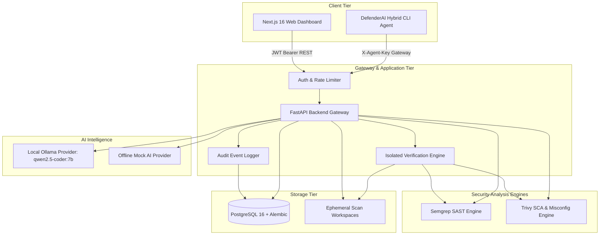

# DefenderAI — System Architecture & Design Specification

DefenderAI is a production-oriented, AI-assisted application security analysis and remediation platform designed for **local-first privacy, cloud deployment readiness, and hybrid enterprise scalability**.

---

## 1. High-Level Architecture

---

## 2. Operational Modes

### 1. Local-First Mode (Primary MVP)
- **Target Audience:** Developers, solo security engineers, and privacy-sensitive teams.
- **Topology:** The frontend, backend, PostgreSQL database, AI model (Ollama `qwen2.5-coder:7b`), and scanners (Semgrep, Trivy) run on the local machine.
- **Privacy Guarantee:** Zero source code, snippets, or findings ever leave `localhost`.

### 2. Cloud Mode
- **Target Audience:** Multi-tenant SaaS, hosted enterprise deployments.
- **Topology:** Centralized cloud dashboard with scalable PostgreSQL, Celery/worker infrastructure, and S3-compatible archive storage.
- **Isolation:** Multi-tenant authorization boundaries enforced at database and API layers with audit logging for all interactions.

### 3. Hybrid Local-Agent Mode
- **Target Audience:** Regulated enterprises, banking, defense, and air-gapped repositories.
- **Topology:** A lightweight agent runner executes inside the corporate firewall or developer workstation.
- **Security Contract:** Scanners execute against local files. Only **sanitized vulnerability metadata** (rule ID, severity, line numbers, CWE/OWASP tags) is transmitted to the cloud gateway. **Zero proprietary source code is transmitted.**

---

## 3. Core Subsystems

### A. Scanning & Finding Normalization Engine
- **SAST (Semgrep):** Detects code injection, deserialization flaws, hardcoded secrets, and taint tracking with CWE and OWASP metadata mapping.
- **SCA (Trivy):** Detects dependency vulnerabilities (CVEs), IaC misconfigurations, and package upgrade recommendations.
- **Unified Finding Schema:** Both scanner outputs are parsed into a normalized database structure tracking rule identifiers, file paths, line ranges, and severity categories (`critical`, `high`, `medium`, `low`, `informational`).

### B. AI Remediation & Provider Abstraction
- Defined by `BaseAIProvider` protocol in `backend/app/services/ai/base.py`:
  - `explain_finding(finding, code_snippet)`: Analyzes root cause, attack vector, impact, and actionable recommendations.
  - `suggest_remediation(finding, code_snippet)`: Produces structured explanations and validated unified diff patches.
  - `check_availability()`: Live probe verifying inference engine reachability and model availability.
- **Anti-Prompt Injection Guardrails:** Code snippets are sanitized and wrapped in `<UNTRUSTED_SOURCE_SNIPPET>` delimiters to prevent untrusted files from manipulating LLM instructions.

### C. Isolated Working-Copy Verification Engine
To prevent hallucinatory or regressive code fixes, DefenderAI follows a strict **empirical verification policy**:
1. **Never mutate primary source during test:** The project workspace is cloned to an isolated, ephemeral sandbox directory (`scan-workspaces/{project_id}/verification-workspaces/{proposal_id}`).
2. **Safe Unified Diff Application:** A pure-Python diff applicator applies the patch with strict path traversal checks (`../../` escape guards) and hunk sliding-window matching.
3. **Automated Re-scan:** The relevant scanner (Semgrep or Trivy) re-scans the patched working copy.
4. **Differential Analysis:**
   - `verified_fixed`: Target vulnerability is eliminated and 0 new findings were introduced.
   - `still_vulnerable`: Target vulnerability persists.
   - `new_findings_introduced`: Patch resolved original issue but introduced a regression.
   - `failed`: Patch failed to apply.
5. **Ephemeral Cleanup:** The sandbox directory is deleted in a `finally` block.

### D. Controlled Codebase Application & Rollback
- Patches can **only** be applied to the primary project source when:
  1. The proposal is explicitly marked `approved` by an authorized user.
  2. The proposal has at least one successful verification (`verified_fixed`).
- **Safety Backups:** Before modifying any file on disk, DefenderAI creates a timestamped copy: `{target_file}.defenderai_bak_{timestamp}`.
- **Instant Rollback:** Users can trigger rollback at any time, restoring original source files from backup copies.

### E. Multi-Tenant Authorization & Audit Stream
- Every REST request validates user ownership (`project.owner_id == current_user.id`). Cross-tenant access attempts return `403 Forbidden`.
- Rate limiting enforces brute-force protection (10 login attempts/min) and compute throttling (10 scans/min).
- Comprehensive immutable audit trail (`audit_events` table) logs user registrations, logins, scan runs, AI explanations, proposal verifications, and patch applications.
